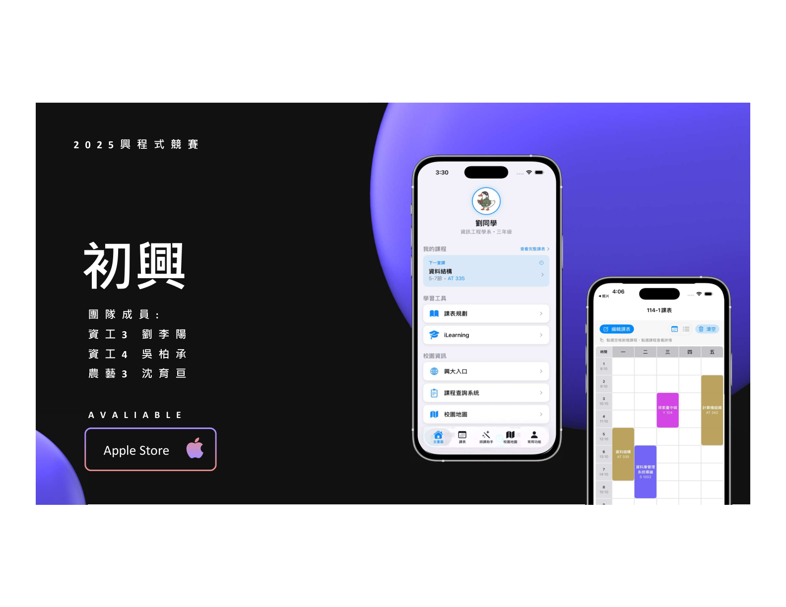
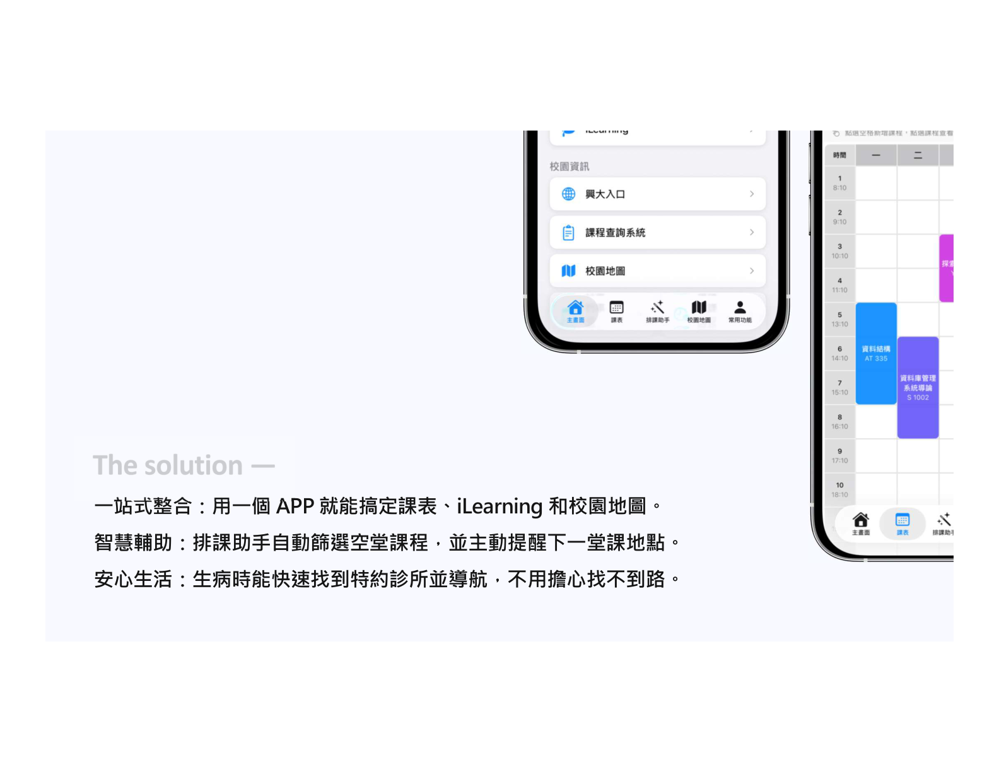
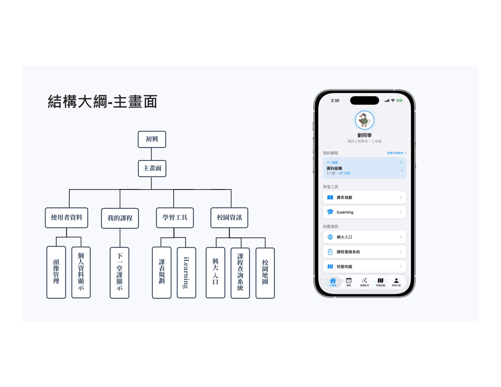
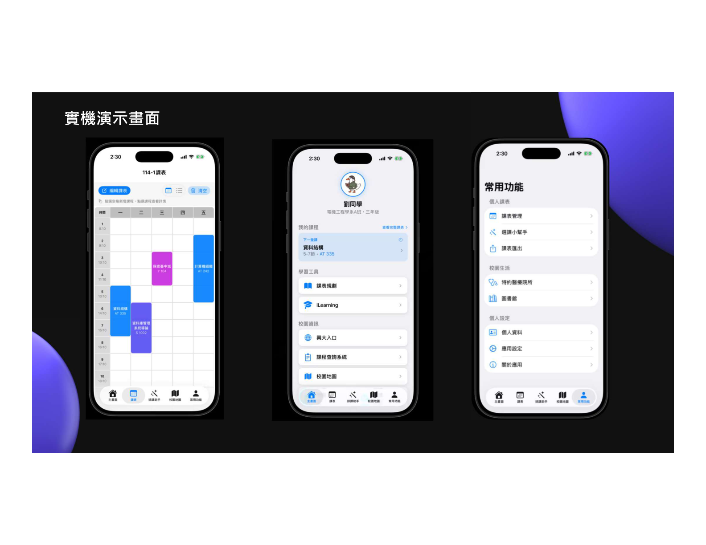
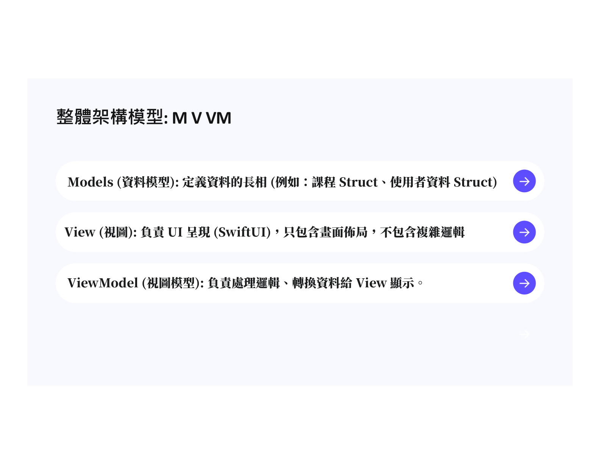
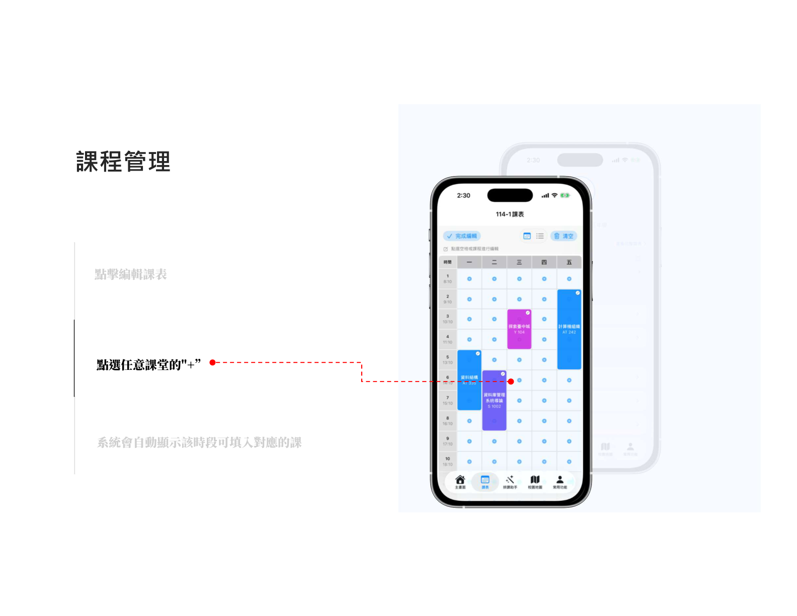

# 初興 (NCHU All-in-One) — 智慧校園一站式整合系統

---

## 🌟 專案願景 (Vision)
「初興」旨在打破中興大學目前碎片化的數位服務現況，透過 **All-in-One 原生 iOS 應用程式**，將原本孤立的網頁服務（iLearning、入口網站、圖書館）整合為具備情境感知能力的智慧助手，消除學生的「切換摩擦」。

---

## 🚀 核心功能與成果演示

### 1. 智慧一站式整合 (All-in-One Dashboard)
- **單一入口**：整合 iLearning、課程查詢、校園地圖於一體。
- **Session 持久化**：內嵌 WebView 確保登入狀態同步，無須反覆登入。

### 2. 智慧排課助手 (Smart Schedule Assistant)
- **自動衝堂偵測**：即時攔截時間衝突課程。
- **空堂通識推薦**：自動篩選使用者空堂時段內的所有通識課程。

### 3. 校園地圖與生活導航 (Campus Navigation)
- **大樓代碼搜尋**：支援 NCHU 特有大樓代號（如 AT, AG）關鍵字檢索。
- **特約醫療地圖**：精確標註校園特約診所，解決資訊不對等問題。

---

## 🛠️ 技術實作 (Technical Implementation)

### 系統架構
本專案採用 **MVVM (Model-View-ViewModel)** 設計模式與 **SwiftUI** 框架，確保 UI 狀態與業務邏輯清晰解耦。

### 關鍵演算法：衝堂偵測 (Conflict Detection)
系統利用 `Set` 的 `isDisjoint` 操作，在選課或手動編輯時即時攔截時間衝突，達到毫秒級反應速度。

---

## 📚 相關研究與文獻引註 (Related Work)

本專案參考以下智慧校園行動平台之學術研究，以強化人機協作效率與系統整合度：

1.  **Dong, Z., et al. (2016)**. *"OnCampus: a mobile platform towards a smart campus."* — 本研究強調了減少資訊過載與提供個性化服務對於提升學生參與度的重要性。
2.  **Madyatmadja, R. M., et al. (2021)**. *"A Review on Smart Campus Concept and Application."* — 詳細探討了物聯網 (IoT) 整合與移動應用對校園運作效率的正面影響。
3.  **Zhang, Y., et al. (2022)**. *"Human-centric smart campus design."* — 提供理應以解決核心持分者（學生）問題為目標的技術設計理論框架。

---

## 📂 專案文檔與連結
- **[📘 技術設計規格書 (TDS)](./docs/system_design_specification.md)**：詳細的系統模型、資料流與演算法說明。
- **[💬 AI 協作對話紀錄 (Chat Log)](./docs/chat_log.md)**：記錄人機協作開發 MVVM 架構與邏輯決策的過程。
- **[🎬 專案介紹影片](https://youtu.be/5bYZXAhFniQ)**：完整功能展示與設計理念說明。
- **[📊 原始提案簡報](./初興_proposal.pptx)**：AIoT 課程提案 PPT。

---

## 👥 團隊成員
*   **電資3 劉李陽**
*   **資工3 王彥翔**
*   **資工3 許唐豪**
