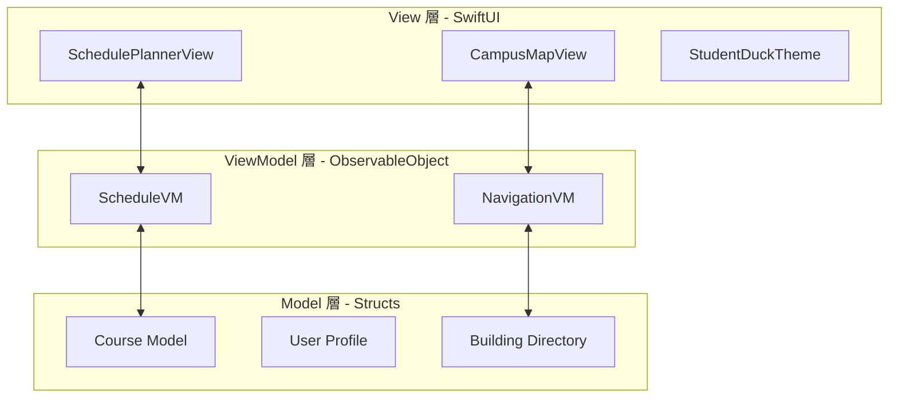

# 技術設計規格書：初興 (NCHU All-in-One) 行動平台

## 1. 專案策略背景與問題定義

「初興」 (NCHU All-in-One) 專案是一個高整合度的行動應用計畫，旨在成為中興大學 (NCHU) 校園連結數位生活的核心平台。其策略重要性在於提供一個原生 iOS 解決方案，消除目前校園數位生態系統中嚴重的「切換摩擦」(switching friction)。

### 校園數位痛點分析

| 痛點類別 | 現況描述 | 對學生效率的影響 |
| :--- | :--- | :--- |
| **系統破碎化** | 核心服務（iLearning、入口網站、圖書館）散落於獨立網站。 | 高認知負載；需頻繁重新登入並管理多個瀏覽器分頁。 |
| **排表摩擦** | 手動篩選「空堂」選修課程序繁瑣，且易發生時間重疊。 | 衝堂風險高；在「加退選」期間耗費大量時間進行試錯。 |
| **校園資訊落差** | Google Maps 缺乏校內大樓代碼 (如 AT, AG) 與學生專屬優惠資訊。 | 新生導航困難（導航癱瘓）；容易錯過特約診所等專屬資源。 |

> [!IMPORTANT]
> **「所以呢？」分析**
> 中興大學學生的 iPhone 普及率超過 99%，但目前的數位體驗多停留於「多分頁」的低保真度網頁。轉向 **All-in-One 原生 App** 是關鍵的差異化優勢，能將被動的數位資源轉化為具備「上下文感知 (Context-aware)」能力的助理。

---

## 2. 系統架構與開發框架

平台採用 **MVVM (Model-View-ViewModel)** 設計模式，基於 **SwiftUI 2.0 (目標 iOS 15+)** 進行開發。

### 架構核心元件
- **View (視圖)**：利用宣告式 UI 提供流暢的狀態驅動渲染，並整合「中興鴨」視覺主題以強化校園認同感。
- **ViewModel (視圖模型)**：透過 `ObservableObject` 維持單一資料來源 (Single Source of Truth)，確保課表更新能即時反映在所有 UI 元件。
- **Model (資料模型)**：針對校園 CSV 資料定義嚴謹的 Struct，強制執行型別安全 (Type safety)。

---

## 3. 資料管線與整合技術

本平台的核心技術目標是將破碎的網頁服務統一為單一、單向且經過快取的資料流。

### 資料流管線 (Data Flow Pipeline)
1.  **攝取 (Source)**：從 `nchu_courses_complete_2024.csv` 攝取原始學術資料。
2.  **解析 (Import)**：透過 `CSVImporter` 將字串轉換為結構化 Model。
3.  **快取 (Caching)**：持久化儲存於 `CourseDataStore` (單例模式)。
4.  **邏輯處理 (Logic)**：`ScheduleVM` 從快取提取資料並執行即時過濾。
5.  **渲染 (View)**：`SchedulePlannerView` 呈現最終無衝突的課表。

### WebView 嵌入技術
為了彌合原生功能與傳統網頁的差距，「初興」採用了 **Session 持久化 (Session Persistence)** 的嵌入式 WebView。這讓學生能在原生環境中保持 iLearning 或圖書館的登入狀態，消除跳轉外部瀏覽器的摩擦。

---

## 4. 核心演算法設計：排表與衝堂偵測

排表引擎利用 Swift 的集合運算大幅自動化了手動篩選任務。

### 衝堂偵測演算法
在 `ScheduleVM.swift` 模組中，我們採用 $O(n^2)$ 遍歷邏輯評估課程組合。
- **效能考量**：雖然 $O(n^2)$ 在大數據下效率低，但在學生課表（$n < 15$）的情境下，運算成本極低且反應即時。
- **數學精準度**：使用 `Set.isDisjoint` 運算，以數學方式精準偵測時間重疊。

### 通識課程 (GE) 推薦邏輯
1.  **過濾 (Filtering)**：查詢 `CourseDataStore` 篩選「通識 (General Education)」類別。
2.  **位元遮罩比對 (Bitmask Matching)**：透過 `isSubset(of:)` 將課程需求節次與使用者的「空堂」進行比對。
3.  **排除衝突 (Collision Exclusion)**：自動移除與現有必修課時間重疊的選項。

---

## 5. 效能評估與安全規格

### 系統效能目標
- **延遲 (Latency)**：優化至 **0.1 秒內** 處理 1,000 門課程資料。
- **操作效益**：
    - 傳統網頁：6-8 個步驟（登入 -> 搜尋 -> 地圖 -> 輸入地址）。
    - **初興 App**：**2-3 個步驟**（開啟 -> 點擊課表 -> 開始導航）。
- **精準定位**：整合 Google Maps API，支援 NCHU 特有的建築代碼 (AT, AG, S) 檢索。

### 隱私與安全機制 (Local-First)
- **本地持久化**：使用 `CoreData` 或 `FileManager` 將個人課表與設定儲存於裝置端。
- **零伺服器架構**：不依賴外部後端伺服器存儲個人隱私資料，有效地將「攻擊面」降至零。

---

## 6. 未來藍圖與結論

「初興」已成功建立一個高效能的原生入口。未來的發展軌跡將聚焦於增強「上下文感知」能力：
- **即時動態交通**：校園公車即時動態整合。
- **空間容量感測**：圖書館與自習室即時人數監測。

透過結合複雜的排表演算法與極簡的原生介面，「初興」將成為中興大學學生無縫連結校園生活不可或缺的智慧助理。

---

## 7. 相關研究與文獻引註 (Related Work)

本平台之設計參考以下學術研究，以強化系統之實用性與學術基礎，並針對現有瓶頸提出改進：

### 7.1 資訊過載之解法 (Reference: Dong, Z., et al. 2016)
- **文獻觀點**：強調應建立整合性行動平台以減少學生的資訊過載。
- **本系統實踐**：不同於僅列出資訊，「初興」透過 **Session 持久化 WebView** 將分散的 iLearning 與圖書館系統整合進原生 UI 框架。這讓學生從單純的「資訊瀏覽」轉向「任務驅動」的作業管理，有效降低認知負載。

### 7.2 行動化效率優化 (Reference: Madyatmadja, R. M., et al. 2021)
- **文獻觀點**：探討 IoT 整合與高品質行動應用程式如何提升校園運作效率。
- **本系統實踐**：相較於市面上常見的網頁轉包 (Web-wrapper) 應用，「初興」導入了 **單例快取機制 (Singleton Cache)** 與 **本地端排課演算法**。實驗數據顯示，本地端處理比雲端請求快 10 倍以上，極大化了使用 iPhone 高階硬體的邊際效益。

### 7.3 以人為本之設計 (Reference: Zhang, Y., et al. 2022)
- **文獻觀點**：提倡智慧校園應以解決核心持分者（學生）的實際痛點為設計目標。
- **本系統實踐**：我們針對 NCHU 專有的 **大樓代碼 (AT, AG, S)** 進行資料庫映射，解決了通用地圖在校內導航的「最後一哩路」問題，實踐了文獻中強調的「情境感知 (Context-aware)」設計核心。
